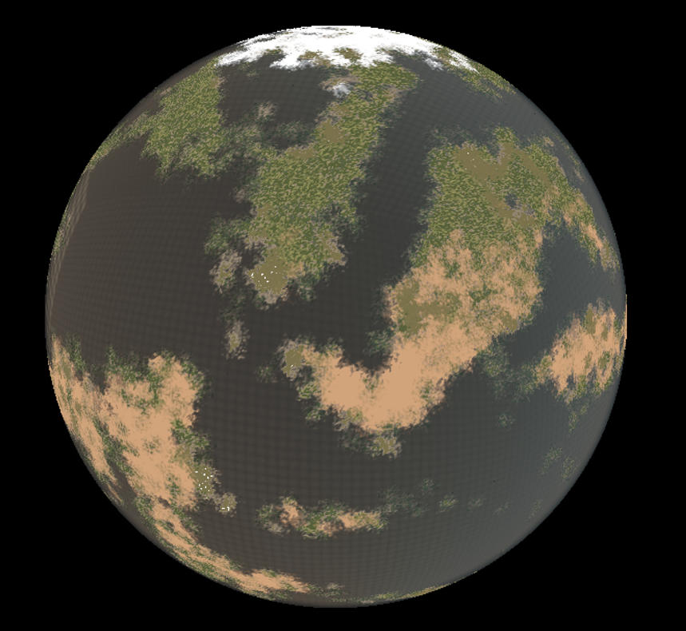

# Biomes

PPG uses a baked biome-cell map to choose and blend biome data across the planet.

## Cell Layout

The biome map stores six cube faces in one texture:

```text
Texture width  = 6 * Biome Cell Resolution
Texture height = Biome Cell Resolution
```

Each texel represents one Voronoi cell. At runtime, the terrain shader samples the biome map, evaluates global height once, then evaluates the selected biome height.

The current shader implementation supports up to 16 biome entries.

## Important Settings

| Setting | Description |
| --- | --- |
| `Biome Cell Resolution` | Number of Voronoi cells along one cube face edge. Higher values add smaller biome cells and a larger generated texture. |
| `Biome Cell Seed` | Seed for deterministic cell placement. |
| `Biome Transition Smoothness` | Width of biome influence falloff around cells, expressed as a fraction of one cell. |
| `Height Blend Biome Materials` | Makes the strongest height contribution control material choice in transition areas. |
| `Biome Material Height Blend Smoothness` | Controls how lower biome materials fade out when height blending is enabled. |
| `Biome Foliage Minimum Blend Strength` | Ignores weak biome blend contributions for foliage spawning. |
| `Biome Voronoi Warp Strength` | Distorts the biome lookup position as a fraction of one cell. Zero disables warp. |
| `Biome Voronoi Warp Scale` | Frequency of the biome lookup warp. |

## Foliage and Biomes

Each biome entry can reference a `Foliage Data Asset`. During terrain generation, foliage can be spawned according to:

- biome blend strength
- terrain height
- terrain slope
- foliage density
- vertex-color density channels
- global foliage density scale on the spawner

## Editing Biomes

After adding, removing, or reordering biome layers, run:

```text
Rebuild Planet Pipeline
```

This updates material node pins, recompiles materials, refreshes the biome map, and regenerates placed planets.


