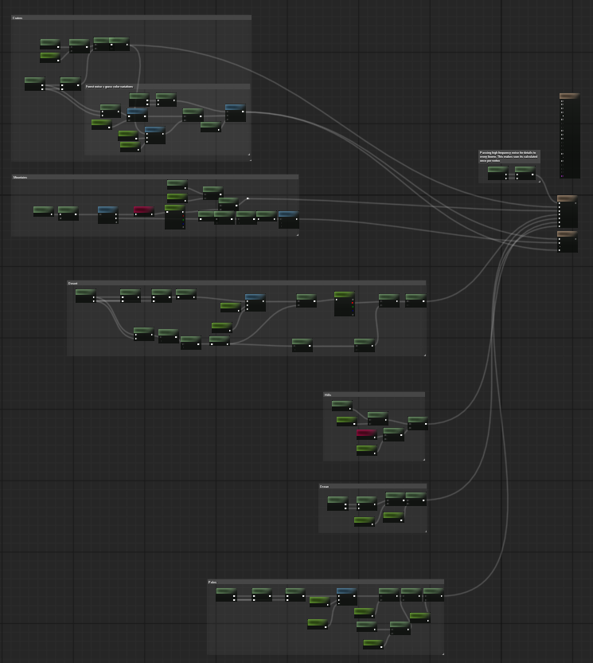
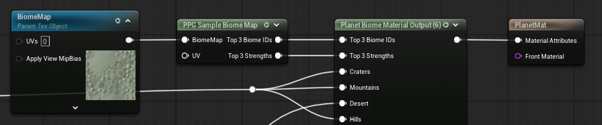

# Material Pipeline

PPG uses custom material nodes instead of Unreal Material Layers for planet generation and biome material blending.

## Required Materials

A complete planet requires three materials. They are not optional for the normal generation pipeline:

| Material | Required Contents | Purpose |
| --- | --- | --- |
| `Biome Mask Material` | Exactly one `Planet Biome Mask Output` node. | Bakes the planet-wide biome-cell texture. |
| `Generation Material` | Exactly one `Planet Elevation Output` and exactly one `Planet Vertex Color Output`. | Computes terrain height, per-biome height, normals, biome data, and vertex color data for chunk generation. |
| `Planet Material` | Runtime surface graph. When using biomes, it uses `Planet Biome Map Sample` and feeds `Planet Biome Material Output`. | Renders generated terrain chunks. |

The rebuild pipeline checks the first two materials strictly. If the biome mask material has zero or multiple `Planet Biome Mask Output` nodes, or the generation material is missing either generation output node, the rebuild fails.

## Pipeline Overview

1. `Biome Mask Material` evaluates the per-biome masks and bakes the `Biome Cell Map` stored on the Planet Data asset.
2. For each terrain chunk, the chunk object prepares a grid of vertices for the selected cube-face patch and recursion level.
3. The compute shader evaluates the `Generation Material` on that grid. It uses the Planet Data settings and baked `Biome Cell Map` to compute global height, selected biome heights, blended elevation, normals, slope, biome IDs, biome strengths, and vertex colors.
4. The terrain readback returns vertex positions, vertex colors, packed normals, biome indices, and slope values. Chunk UVs are generated on the CPU, and per-vertex height is derived from the returned position.
5. The chunk builds a runtime static mesh or Nanite mesh from the generated positions, packed normals, UVs, vertex colors, and shared triangle indices.
6. Collision, ray tracing proxy data, water meshes, and foliage data are created according to the spawner settings.
7. The visible `Planet Material` is assigned to the terrain mesh. The chunk also creates a per-chunk runtime render target named `BiomeMap` and sets it as a texture parameter on that material.
8. In the surface material, `Planet Biome Map Sample` owns and reads the fixed `BiomeMap` texture parameter and outputs the three strongest `Biome IDs` and `Strengths`.
9. `Planet Biome Material Output` maps the Planet Data biome IDs to its named entries, then selects and blends the corresponding Material Attributes.
10. `Planet Biome Strengths` can expose any of those strengths as named scalar masks for other surface-material logic.

`Biome Cell Map` and `BiomeMap` are different resources. `Biome Cell Map` is the baked Planet Data texture used to choose biomes across the planet. `BiomeMap` is generated per chunk and is used by the surface material to render the chunk's current biome blend.

## Biome Mask Material

The biome mask material must contain exactly one `Planet Biome Mask Output` node.

The node has one scalar mask input per biome entry. Later biome layers have higher priority during biome map baking. It also owns `Biome Cell Resolution` and `Biome Cell Seed`.

## Generation Material

The generation material must contain:

- one `Planet Elevation Output`
- one `Planet Vertex Color Output`

`Planet Elevation Output` exposes:

- `Global Height`
- one height input per biome entry

It also owns biome transition, height-based material blending, and Voronoi warp settings. These values are synchronized into the Planet Data asset's cooked runtime cache by the rebuild pipeline.

`Planet Vertex Color Output` exposes one vertex color input per biome entry. The resulting vertex colors can be used by terrain materials and by foliage density masks.

Typical generation nodes:

- `Planet Position`
- `Planet Noise`
- `Planet Global Height`
- `Planet Cell Origin`
- `Planet Cell Position`
- `Planet Elevation Output`
- `Planet Vertex Color Output`

## Surface Material

The surface material is the visible material assigned as `Planet Material` on the Planet Data asset.

For biome materials, use this graph shape:

1. Add `Planet Biome Map Sample`. The node owns the fixed texture parameter `BiomeMap`; no separate texture-object node is required.
2. Connect its `Biome IDs` output to `Planet Biome Material Output` input `Biome IDs`.
3. Connect its `Strengths` output to `Planet Biome Material Output` input `Biome Strengths`.
4. Connect one Material Attributes graph to each named biome input on `Planet Biome Material Output`.
5. Connect `Planet Biome Material Output` to the material's Material Attributes output.

At runtime, every terrain chunk replaces the sample node's `BiomeMap` parameter with its generated per-chunk texture.

### Named Biome Strength Masks

`Planet Biome Strengths` exposes named `0-1` masks from the same sampled biome data:

1. Connect `Planet Biome Map Sample` output `Biome IDs` to `Planet Biome Strengths` input `Planet Biome IDs`.
2. Connect `Planet Biome Map Sample` output `Strengths` to `Planet Biome Strengths` input `Biome Strengths`.
3. Set `Biome Count` and add an `Entry Name` for each mask required by the graph.
4. Match each entry name to a biome name in the Planet Data asset.
5. Use the named scalar outputs for color, roughness, foliage-style surface effects, or other material blending.

A named output is zero when its biome is not one of the top three contributors at the current pixel or its name does not exist in the active Planet Data asset. When `Height Blend Biome Materials` is enabled, these outputs represent the height-blended strengths stored in the chunk `BiomeMap`.

Share one `Planet Biome Map Sample` between `Planet Biome Material Output`, `Planet Biome Strengths`, and the rest of the surface graph. Each separate sample node repeats the biome-map texture loads, accumulation, and sorting. Reusing the same sample keeps that work shared.

## Name-Based Pin Synchronization

Biome entry synchronization is name-based.

The Planet Data asset normalizes each biome layer name. Empty names become `Biome 1`, `Biome 2`, and so on. The output nodes then match their `Entry Names` against those normalized Planet Data names.

This means:

- output node and `Planet Biome Strengths` entry names must match Planet Data biome names to sync correctly
- pins are not renamed magically unless the node entry names are edited to match
- duplicate names use the first matching output entry
- unmatched Planet Data biomes are mapped to no input for that material output
- the shader supports up to 16 biome entries

Run `Rebuild Planet Pipeline` after changing biome names, biome order, output node entry names, or linked materials.

## Automatic Material Updates

In the editor, linked material recompiles are watched by placed `Planet Spawner` actors:

- recompiling the `Biome Mask Material` refreshes the biome map and regenerates the planet
- recompiling the `Generation Material` refreshes generation node maps and regenerates the planet
- recompiling the `Planet Material` refreshes its surface biome mappings when it contains `Planet Biome Material Output` or `Planet Biome Strengths`

If a material change does not produce the expected result, run `Rebuild Planet Pipeline` from the Planet Data asset.

## Exposed Runtime Parameters

PPG sets several runtime material parameters on terrain and water dynamic material instances. See [Exposed Material Parameters](../reference/exposed-material-parameters.md) for the full list.

