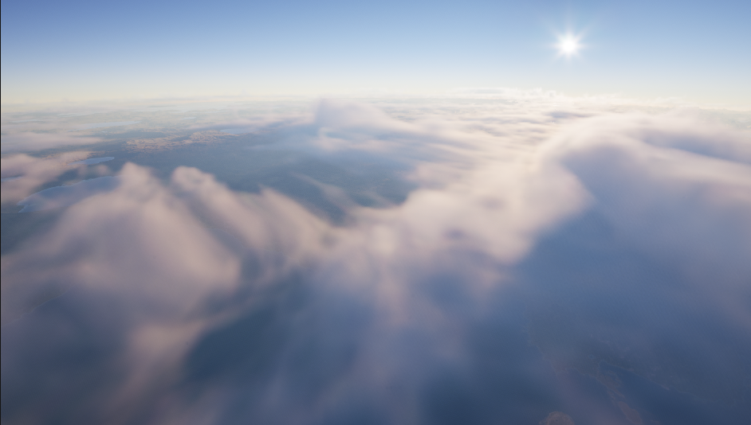

# Clouds and Gravity

## Volumetric Clouds

`Planet Spawner` can reference a `Volumetric Cloud Actor`.

Use:

```text
Update Volumetric Cloud Parameters
```

to push planet-related values to the cloud setup when needed.

The plugin includes cloud support assets under:

```text
Content/Clouds/
```



## Gravity Controller

`AGravityController` is a player controller helper for custom gravity movement. It provides Blueprint-pure helpers for converting rotations:

| Function | Purpose |
| --- | --- |
| `GetGravityRelativeRotation` | Converts a world-space rotation to gravity-relative space. |
| `GetGravityWorldRotation` | Converts a gravity-relative rotation to world space. |

Use these helpers when player camera/control rotation must remain stable as gravity changes around a spherical planet.

The gravity controller approach is based on Epic's [Custom Gravity in UE 5.4](https://dev.epicgames.com/community/learning/tutorials/w6l7/unreal-engine-custom-gravity-in-ue-5-4) community tutorial.
