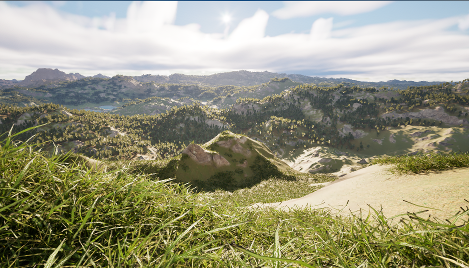
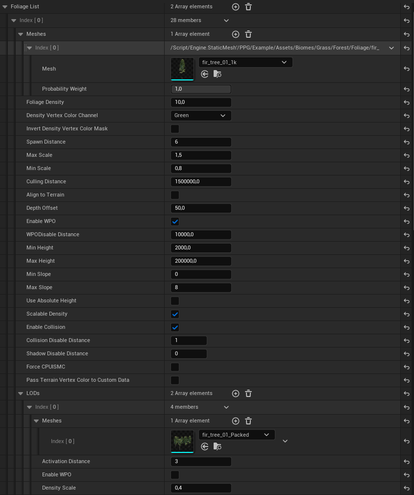

# Foliage

Foliage is configured per biome through `Foliage Data Asset` references.

## Foliage Data Asset

A `Foliage Data Asset` contains a list of foliage entries. Each entry can define:

- one or more mesh variants
- density
- spawn distance
- scale range
- culling distance
- terrain alignment
- height and slope limits
- collision behavior
- rendering behavior
- optional LOD entries
- optional deterministic clustering across chunk boundaries

## Mesh Variants

Each foliage entry has a `Meshes` array. Each mesh variant has:

| Field | Description |
| --- | --- |
| `Mesh` | Static mesh to spawn. |
| `Probability Weight` | Relative selection weight, normalized among valid variants in the entry. |

Each LOD entry has a `Meshes` array aligned by index with the base variants. An empty LOD slot falls back to the corresponding base mesh. LODs can also change activation distance, WPO state, and density scale.

## Density Masks

Foliage density can be multiplied by a terrain vertex-color channel:

- `None`
- `Red`
- `Green`
- `Blue`
- `Alpha`

`Invert Density Vertex Color Mask` flips the mask so dark areas spawn more foliage and bright areas spawn less.

Use this together with `Planet Vertex Color Output` in the generation material.

## Placement Filters

Common placement controls:

| Setting | Description |
| --- | --- |
| `Min Height` / `Max Height` | Height range for spawning. |
| `Min Slope` / `Max Slope` | Slope range for spawning. |
| `Align To Terrain` | Rotates instances to terrain normals. |
| `Depth Offset` | Moves instances relative to the terrain surface. |
| `Use Absolute Height` | Treats height as always zero. |
| `Uniform Scale` | Uses one random value on all axes; when disabled, X/Y/Z are randomized independently inside the `Scale` interval. |

## Clustering

Enable `Clustering` to create deterministic groups that continue across chunk boundaries. `Cluster Size Min` and `Cluster Size Max` control the number of members; `Cluster Radius` controls their spread. The maximum is clamped to at least the minimum during asset validation.

## Runtime Limits

The spawner can globally scale or limit foliage:

- `Generate Foliage`
- `Global Foliage Density Scale`
- `Foliage Upload Batch Size`
- `Max Foliage Instances Per Chunk`
- `Max Concurrent GPU Generations`
- `Max Pooled Foliage ISM Components`
- `Max Pooled GPU Foliage Components`

## GPU and CPU Rendering Paths

Foliage can use GPU foliage components when collision is disabled. Use `Force CPU ISMC` if you need CPU-backed instanced static mesh components even without collision.

`Pass Terrain Vertex Color To Custom Data` exposes nearest terrain vertex color as four per-instance custom data floats.

Rendering controls also include:

- `Enable WPO` and `WPO Disable Distance`; a zero disable distance leaves WPO enabled at all distances
- `Visible In Ray Tracing`
- the spawner's `Foliage Shadow Cache Mode`: `Accurate` preserves animated WPO shadows, while `Cached` keeps rigid shadows cached for lower invalidation cost

