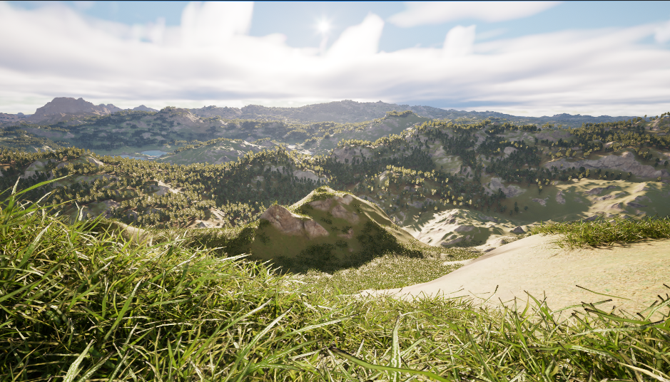
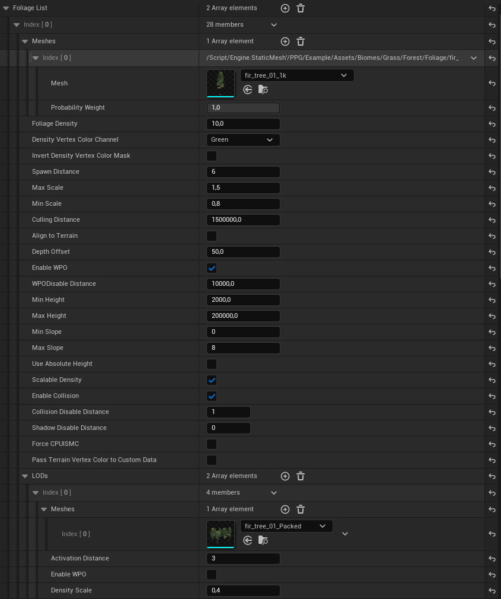

# Foliage

Foliage is configured per biome through `Foliage Data Asset` references.

## Foliage Data Asset

A `Foliage Data Asset` contains a list of foliage entries. Each entry can define:

- one or more mesh variants
- density
- spawn distance
- scale range
- culling distance
- terrain alignment
- height and slope limits
- collision behavior
- rendering behavior
- optional LOD entries
- optional deterministic clustering across chunk boundaries

## Mesh Variants

Each foliage entry has a `Meshes` array. Each mesh variant has:

| Field | Description |
| --- | --- |
| `Mesh` | Static mesh to spawn. |
| `Probability Weight` | Relative selection weight, normalized among valid variants in the entry. |

Each LOD entry has a `Meshes` array aligned by index with the base variants. An empty LOD slot falls back to the corresponding base mesh. LODs can also change activation distance, WPO state, and density scale.

## Density Masks

Foliage density can be multiplied by a terrain vertex-color channel:

- `None`
- `Red`
- `Green`
- `Blue`
- `Alpha`

`Invert Density Vertex Color Mask` flips the mask so dark areas spawn more foliage and bright areas spawn less.

Use this together with `Planet Vertex Color Output` in the generation material.

## Placement Filters

Common placement controls:

| Setting | Description |
| --- | --- |
| `Min Height` / `Max Height` | Inclusive height range for spawning. |
| `Height Cutoff Smoothness` | Feather width in centimeters inside both height cutoffs. Zero keeps the height filter hard. |
| `Min Slope` / `Max Slope` | Inclusive slope range for spawning. |
| `Slope Cutoff Smoothness` | Feather width, using the existing slope scale, inside both slope cutoffs. Zero keeps the slope filter hard. |
| `Align To Terrain` | Rotates instances to terrain normals. |
| `Depth Offset` | Moves instances relative to the terrain surface. |
| `Use Absolute Height` | Treats height as always zero. |
| `Uniform Scale` | Uses one random value on all axes; when disabled, X/Y/Z are randomized independently inside the `Scale` interval. |

Positive cutoff smoothness reduces spawn probability near both ends of its allowed range. The lower ramp increases from zero at `Min` to full strength at `Min + Smoothness`; the upper ramp decreases from full strength at `Max - Smoothness` to zero at `Max`. The ramps stay inside the configured range, so smoothing never permits foliage outside the minimum or maximum cutoff.

Height and slope masks are multiplied before the deterministic spawn test. If the two ramps of one filter overlap because the allowed range is narrower than twice its smoothness, the overlap remains partially attenuated rather than being forced to full strength. Existing assets keep their previous inclusive hard-cutoff behavior because both smoothness settings default to `0`.

## Clustering

Enable `Clustering` to create deterministic groups that continue across chunk boundaries. `Cluster Size Min` and `Cluster Size Max` control the number of members; `Cluster Radius` controls their spread. The maximum is clamped to at least the minimum during asset validation.

## Foliage Collision

Foliage physics is generated by the planet collision grid rather than by visible terrain chunks. Enable `Generate Collisions` and `Generate Foliage Collision` on the Planet Spawner, then enable `Enable Collision` on each foliage entry that requires physics.

`Collision Range` controls the maximum surface distance from a collision invoker. Range relevance is evaluated per collision cell, so a cell that intersects the range can contain collision foliage across its complete area. A negative serialized value derives a centimeter range from the deprecated recursion-distance setting.

Collision generation uses base mesh variants and evaluates the same placement inputs as rendered foliage:

- height and slope filters
- terrain alignment and depth offset
- vertex-color density masks
- scale ranges and mesh probabilities
- deterministic clustering

Distance-based PPG foliage LOD substitutions do not affect collision foliage. Collision instances are grouped by static mesh into physics-only, non-rendering instanced components. See [Collision Streaming](collision.md) for collision-grid sizing and runtime behavior.

## Runtime Limits

The spawner can globally scale or limit foliage:

- `Generate Foliage`
- `Global Foliage Density Scale`
- `Foliage Upload Batch Size`
- `Max Foliage Instances Per Chunk`
- `Max Concurrent GPU Generations`
- `Max Pooled Foliage ISM Components`
- `Max Pooled GPU Foliage Components`

## GPU and CPU Rendering Paths

Visible foliage can use GPU foliage components even when its entry has collision enabled because physics is owned by the collision grid. Use `Force CPU ISMC` only when the visible instances specifically require CPU-backed instancing.

`Pass Terrain Vertex Color To Custom Data` exposes nearest terrain vertex color as four per-instance custom data floats.

`Force Mesh LOD 0` is enabled by default. When enabled, it is a component-wide override: PPG applies it to every CPU ISMC or GPU-indirect component spawned for the foliage entry, so every instance belonging to each component renders the selected static mesh's internal LOD 0.

When disabled, Unreal normally selects the internal static-mesh LOD per instance. Instances in the same component can therefore render different internal mesh LODs simultaneously. Per-instance selection requires GPU Scene and `r.InstancedStaticMeshes.GpuLod 1`; if unavailable, Unreal falls back to component-level selection. This setting is independent of the PPG `LODs` array, which selects alternate foliage mesh assets by chunk distance.

Rendering controls also include:

- `Enable WPO` and `WPO Disable Distance`; a zero disable distance leaves WPO enabled at all distances
- `Visible In Ray Tracing`
- the spawner's `Foliage Shadow Cache Mode`: `Accurate` preserves animated WPO shadows, while `Cached` keeps rigid shadows cached for lower invalidation cost

