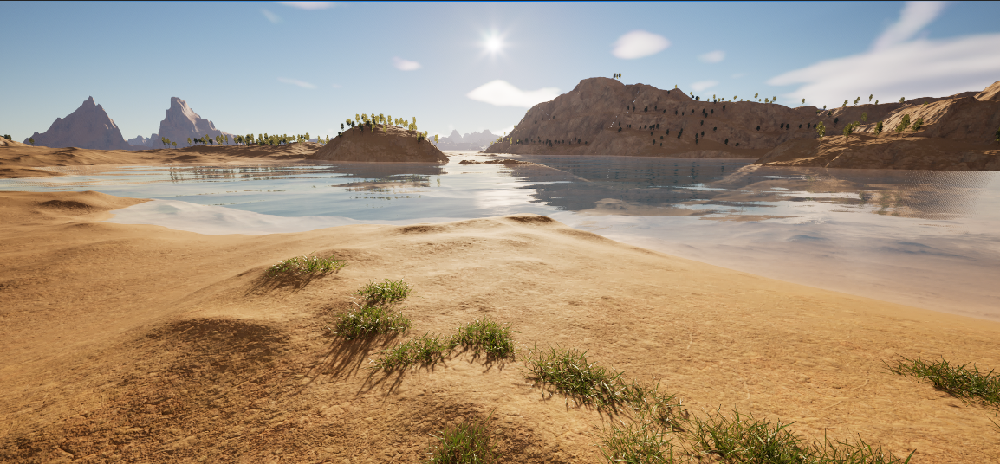

# Terrain Generation

Terrain generation is driven by the `Planet Spawner`, `Planet Data Asset`, custom material nodes, and compute shader readback.

## Chunk Quality

`Chunk Quality` controls the vertex resolution of generated terrain chunks. Higher values increase detail, but also increase:

- compute shader work
- GPU readback size
- CPU mesh build cost
- memory use
- collision build cost when collision is enabled

## Recursion Levels

The planet data asset controls:

- `Min Recursion Level`
- `Max Recursion Level`

Higher recursion levels create smaller terrain chunks and allow more local detail. They also increase the number of chunks around the viewer.

## Collision

Enable `Generate Collisions` on the spawner to build collision for generated terrain chunks.

`Collision Disable Distance` controls how far collision remains active. This helps avoid paying collision cost for distant terrain.

## Nanite and Ray Tracing

The spawner exposes:

- `Nanite Landscape`
- `Generate Ray Tracing Proxy`

Use these according to project rendering needs and platform targets. Nanite terrain is useful for high-detail planet surfaces, while ray tracing proxies add cost and should be enabled only when the project needs them.

## UV Precision

The spawner exposes two terrain UV precision settings:

| Setting | Description |
| --- | --- |
| `Generate Second UV Channel` | Generates a second terrain UV channel used by `Planet UVs` for high-precision chunk UV reconstruction. |
| `Use Full Precision UVs` | Uses full 32-bit precision for terrain UV storage when the second UV channel is disabled. |

Use one of these if material UV precision issues appear on large planets.

