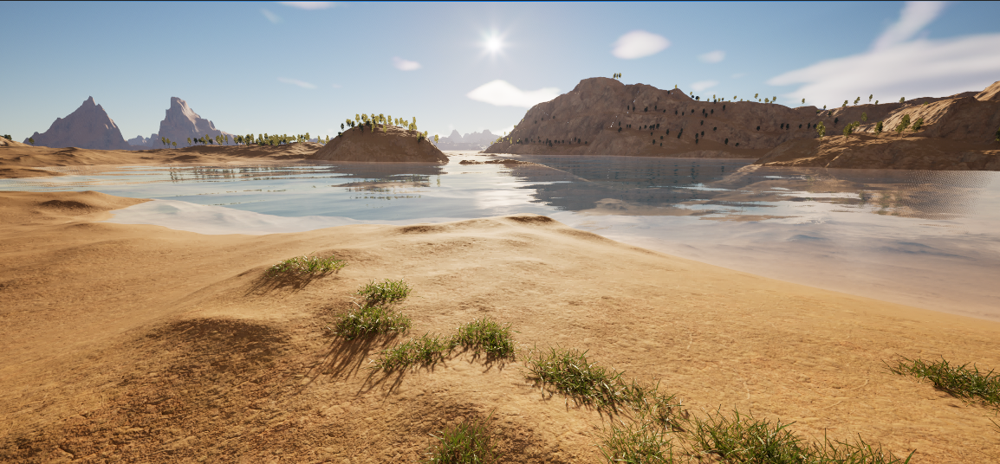

# Terrain Generation

Terrain generation is driven by the `Planet Spawner`, `Planet Data Asset`, custom material nodes, and compute shader readback.

## Chunk Quality

`Chunk Quality` controls the vertex resolution of generated terrain chunks. Higher values increase detail, but also increase:

- compute shader work
- GPU readback size
- CPU mesh build cost
- memory use
- collision build cost when collision is enabled

## Deterministic Generation

`Generation Seed` on the Planet Data asset is supplied to terrain material expressions. With identical graph inputs and the same seed, generation is deterministic.

## Recursion Levels

The planet data asset controls:

- `Min Recursion Level`
- `Max Recursion Level`

Higher recursion levels create smaller terrain chunks and allow more local detail. They also increase the number of chunks around the viewer.

## Screen Space LOD

Enable `Use Screen Space LOD` on the spawner to select terrain recursion from projected vertex spacing on screen. `LOD Target Pixel Error` is the split threshold: lower values retain finer chunks farther from the camera. `LOD Merge Hysteresis` keeps a chunk from repeatedly splitting and merging near the threshold. `LOD Geometric Error Scale` adjusts the estimated error when the default selection is too coarse or too fine.

The Planet Data asset's minimum and maximum recursion levels still bound the available detail. Increase detail only where it is visible; finer LODs also raise chunk generation and memory costs.

## Generated Surface Normals

Enable `Generate Detailed Normals` on the spawner and place `Planet Apply Generated Surface Normal` after the completed Material Attributes in the planet surface material. Connect its output directly to the material output, then regenerate existing chunks. The node uses the generated full-resolution terrain normal while preserving normal-map detail already present in the attributes. Disable `Preserve Material Normal Detail` on the node if only the generated shape normal is wanted.

`Planet Generated Surface Normal` exposes that normal and radial slope for material masks. Use its slope outputs when a material needs terrain slope that remains detailed on distant, reduced-density geometry. Detailed normals add a generated texture per visible chunk; leave the option disabled if the material does not use it.

## Terrain Stamps

`Planet Height Brush` actors can modify terrain height, biome assignment, material and foliage weights, vertex colors, or remove terrain triangles. Optional texture masks provide local shape control.

See [Terrain Stamps](terrain-stamps.md) for setup, overlap behavior, texture masks, and cache details.

## Collision

Terrain collision is generated on a fixed planet-wide grid around collision invokers. It is independent of the visible terrain quadtree, so visual LOD changes do not determine where physics exists.

See [Collision Streaming](collision.md) for invoker setup, chunk sizing, foliage collision, editor placement, loading readiness, and performance controls.

## Nanite

Enable `Nanite Landscape` when the project benefits from Nanite terrain rendering and the target platform supports it. Nanite chunks can render high-detail planet surfaces well, but they are slower to build than normal static mesh chunks. Expect higher generation/build cost when chunks are created or regenerated.

## Ray Tracing Proxy and Lumen

Enable `Generate Ray Tracing Proxy` when the planet needs to be visible to hardware ray tracing features. Software Lumen is not supported for the generated planet terrain.

Ray tracing proxies add build and memory cost, so keep them disabled when the project does not use Hardware Lumen or other hardware ray tracing features.

`Ray Tracing Recursion Level Margin` controls which terrain LOD levels build proxy data. A value of `0` limits proxy data to chunks at `Max Recursion Level`; higher values include additional coarser chunk levels below `Max Recursion Level`.

## Generation Shader Precision

Terrain generation precision is selected at shader compile time in:

```text
Plugins/ProceduralPlanetGeneration/Shaders/PlanetPrecision.ush
```

Set `PPG_USE_DOUBLE_FLOAT` to `1` for the double-float generation path, or `0` for the float generation path. A different value requires recompiling the shaders.

## UV Precision

The spawner exposes two terrain UV precision settings:

| Setting | Description |
| --- | --- |
| `Generate Second UV Channel` | Generates a second terrain UV channel used by `Planet UVs` for high-precision chunk UV reconstruction. |
| `Use Full Precision UVs` | Uses full 32-bit precision for terrain UV storage when the second UV channel is disabled. |

Use one of these if material UV precision issues appear on large planets.



## Generation Throttles

Use these spawner controls to trade total generation time for steadier frame time and lower peak memory:

- `Max Chunk Generation Starts Per Frame`
- `Max Chunk Completions Per Frame`
- `Max Concurrent GPU Generations`
- `Max Concurrent Mesh Builds`

`Use Lightweight Terrain Component` uses a render-only component for ordinary non-Nanite visual chunks. Keep it enabled unless a project needs to compare the alternative static-mesh path. Nanite, collision, and ray-tracing proxy chunks use their required paths.

`Get Planet Generation Status` returns the current phase, progress, completed/total chunk counts, elapsed milliseconds, error text, and whether generation is active.
