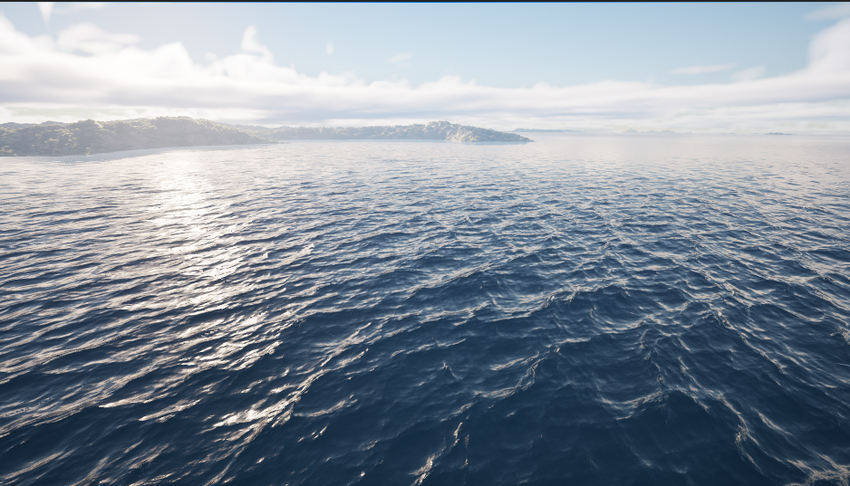
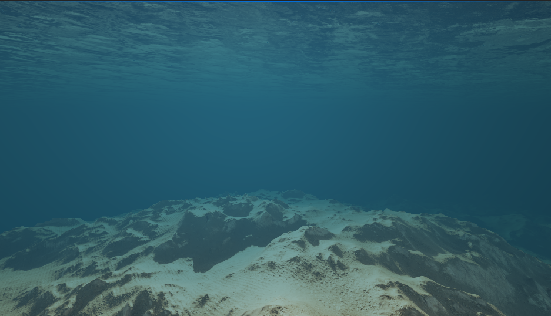

# Water

PPG can generate planetary water meshes and drive a Niagara ocean wave simulation.

## Enabling Water

In the `Planet Data Asset`, enable:

```text
Generate Water
```

Then assign:

- `Water Material`
- `Far Water Material`
- optional `Water Simulation Data`
- `Recursion Level For Material Change`

The spawner controls runtime water generation and simulation behavior.

## Spawner Water Settings

| Setting | Description |
| --- | --- |
| `Enable Niagara Wave Simulation` | Starts or stops the Niagara wave simulation component. |
| `Max Recursion Water Tessellation` | Water quads per edge for chunks at maximum terrain recursion level. |
| `Far Water Tessellation` | Water quads per edge for chunks below maximum terrain recursion level. |
| `Generate Custom Depth Water Coverage` | Generates hidden custom-depth water coverage for underwater post processing. |
| `Custom Depth Water Resolution Percent` | Tessellation scale for custom-depth-only water coverage. |
| `Custom Depth Water Material` | Material used by custom-depth-only water chunks. |
| `Generate Water Skirts` | Adds inward radial skirts to hide cracks between water chunks. |
| `Water Skirt Length Scale` | Skirt length as a fraction of chunk size. |

## Water Simulation Data

`Water Simulation Data Asset` stores parameters uploaded to the Niagara water simulation. It does not store render target bindings.

Notable groups:

- `Water|Per Cascade`: amplitude, choppiness, patch length, cutoffs, wind tighten
- `Water|Foam`: injection, threshold, fade, blur
- `Water|Wind`: wind speed and direction
- `Water|Roughness`: roughness power and sample count
- `Water|Misc`: repeat period and gravity

The ocean simulation is based on Epic's [Ocean Simulation](https://dev.epicgames.com/community/learning/tutorials/qM1o/unreal-engine-ocean-simulation) community tutorial. That tutorial is also a useful reference for what the simulation parameters mean.

## Water Material Nodes

PPG includes water-specific material expressions:

- `Planetary Water Shading`
- `Planetary Underwater Post Process`

Use these in water and post-process materials when you need physically motivated scattering, absorption, horizon-aware lighting, and underwater color attenuation.




