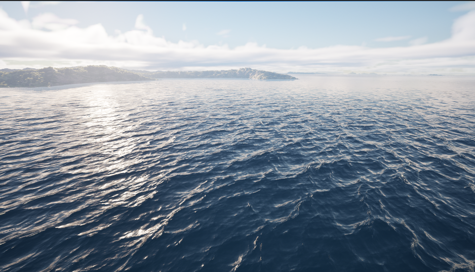
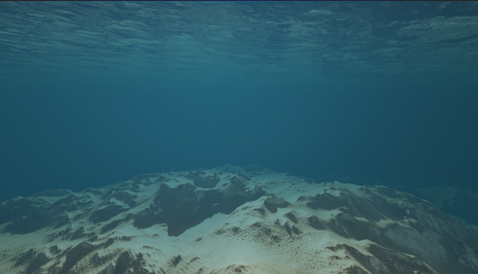

# Water

PPG can generate planetary water meshes and drive a native C++/HLSL GPU ocean wave simulation.

## Enabling Water

In the `Planet Data Asset`, enable:

```text
Generate Water
```

Then assign:

- `Water Material`
- `Far Water Material`
- optional `Water Simulation Data`
- `Recursion Level For Material Change`

The spawner controls runtime water generation and simulation behavior.

For water using the `Single Layer Water` shading model, use the `Planetary Single Layer Water` output in the water material. Its scattering and absorption coefficients are per centimeter; `Density Scale` multiplies both. The planetary output supplies radial sea-surface geometry to PPG's water shader hook. Install **Planetary Single Layer Water** under **Project Settings > Plugins > Procedural Planet Generation - Shader Hooks**, restart the editor, and recompile the material.

## Spawner Water Settings

| Setting | Description |
| --- | --- |
| `Enable Ocean Simulation` | Starts or stops the native GPU ocean simulation. |
| `Max Recursion Water Tessellation` | Water quads per edge for chunks at maximum terrain recursion level. |
| `Far Water Tessellation` | Water quads per edge for chunks below maximum terrain recursion level. |
| `Generate Custom Depth Water Coverage` | Generates hidden custom-depth water coverage for underwater post processing. |
| `Custom Depth Water Resolution Percent` | Tessellation scale for custom-depth-only water coverage. |
| `Custom Depth Water Material` | Material used by custom-depth-only water chunks. |
| `Generate Water Skirts` | Adds inward radial skirts to hide cracks between water chunks. |
| `Water Skirt Length Scale` | Skirt length as a fraction of chunk size. |

## Water Simulation Data

`Water Simulation Data Asset` stores the spectral, foam, wind, roughness, and timing parameters used by the native ocean simulation. It does not store render targets.

Notable groups:

- `Water|Per Cascade`: amplitude, choppiness, patch length, cutoffs, wind tighten
- `Water|Foam`: injection, threshold, fade, blur
- `Water|Wind`: wind speed and direction
- `Water|Roughness`: roughness power and sample count
- `Water|Misc`: repeat period and gravity

The ocean simulation is based on Epic's [Ocean Simulation](https://dev.epicgames.com/community/learning/tutorials/qM1o/unreal-engine-ocean-simulation) community tutorial. That tutorial is also a useful reference for what the simulation parameters mean.

## Shared Simulations

The plugin automatically creates a per-world actor named `PPG Water Simulations`. This actor owns the simulation components and is visible in the World Outliner for inspection, but it is managed by the plugin and cannot be deleted manually.

Each distinct `Water Simulation Data` asset receives one simulation component and one set of transient runtime render targets. Multiple planets using the same asset share those resources and the associated GPU work. Use different data assets when planets need independent wave conditions.

## SM5 and SM6

The native simulation supports D3D11/SM5, D3D12/SM5, and D3D12/SM6. SM6 uses the optimized in-place FFT and single export pass. SM5 uses compatibility scratch resources and two export passes to remain within the eight-UAV limit. The SM5 compatibility path does not reduce SM6 performance.

## Water Material Nodes

PPG includes water-specific material expressions:

- `Planetary Water Shading`
- `Planetary Underwater Post Process`
- `Planetary Single Layer Water`
- `Planet Seamless Water`
- `Planet Water Vertex Coordinates`
- `Planet Water UV`

Use the nodes that match the material's wave, water shading, and underwater effects.

### Seamless Wave Mapping

`Planet Seamless Water` samples the ocean simulation across cube faces. Its outputs provide world-space displacement and normal, foam, and Jacobian:

1. Connect `Displacement WS` to the water material's world-position offset path.
2. Pass each `Packed Cascade 0–3` output of `Planet Water Vertex Coordinates` through its own `VertexInterpolator` to the matching `Vertex Cascade 0–3` input on `Planet Seamless Water`.
3. Use `Normal WS` for wave shading. Transform it to tangent space when the material uses tangent-space normals.
4. Use `Foam` as a mask for foam color, roughness, or normal detail.

`Wave Strength` defaults to 1, and disconnected `Cascade Weights` enable all four cascades. Keep the same strength and weights for displacement and shading. `Precise Close Normals` improves nearby normal filtering at additional texture-sampling cost.

`Planet Water UV` supplies a tiled UV for decorative foam or normal textures. Its `Grid UV` output is for the generated height-mask sampling path; keep it connected when the water material uses terrain height to attenuate waves.




