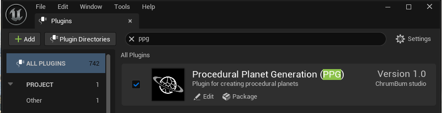

# Installation

## Add the Plugin

Copy the `ProceduralPlanetGeneration` plugin folder into your Unreal project:

```text
YourProject/
  Plugins/
    ProceduralPlanetGeneration/
```

Then regenerate project files if your project uses C++, open the project, and enable the plugin if Unreal does not enable it automatically.

The plugin contains content, so make sure plugin content is visible in the Content Browser. The spawner Blueprint and the included reference assets both live in plugin content.

## Required Plugin Dependencies

PPG enables the Unreal `Niagara` plugin because the water wave simulation uses Niagara systems.

The plugin also includes VoxelCore-derived support code internally. No separate VoxelCore plugin installation is required.

## Included Modules

| Module | Purpose |
| --- | --- |
| `PPG` | Main runtime/editor-facing planet generation code. |
| `ComputeShader` | GPU compute shader interfaces used by terrain and foliage generation. |
| `VoxelCore` | Bundled utility code used by the runtime implementation. |

## Included Content

The plugin ships with the reusable spawner Blueprint, example content, and support assets, including:

- `Content/PlanetSpawnerBP`, the Blueprint users normally place in a level
- `Content/Example/Level/PPGExampleLevel`
- `Content/Example/Assets/ExamplePlanetData`
- `Content/Example/Assets/ExamplePlanetGenerationMaterial`
- Water materials, render targets, Niagara modules, and water simulation assets under `Content/Water`
- Cloud material assets under `Content/Clouds`


