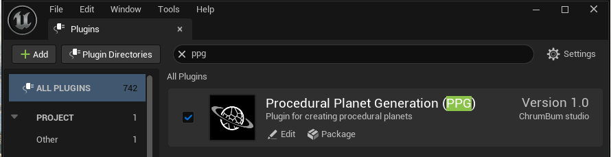

# Installation

## Add the Plugin

Copy the `ProceduralPlanetGeneration` plugin folder into your Unreal project:

```text
YourProject/
  Plugins/
    ProceduralPlanetGeneration/
```

Then regenerate project files if your project uses C++, open the project, and enable the plugin if Unreal does not enable it automatically.

The plugin contains content, so make sure plugin content is visible in the Content Browser. The spawner Blueprint and the included reference assets both live in plugin content.

## Rendering Requirements

PPG supports Win64 D3D11/SM5, D3D12/SM5, and D3D12/SM6 projects. Projects that ship an
SM5 configuration must include `PCD3D_SM5` in their Windows targeted shader formats so the
generation and biome-mask compute permutations are cooked into the build.

Nanite and hardware ray tracing activate only when requested and supported by the active
shader platform. Otherwise, terrain automatically uses the complete conventional static-mesh
path and skips ray-tracing proxy initialization. The generated water surface and native GPU
wave simulation are available on both SM5 and SM6. SM6 retains the optimized in-place FFT and
single-pass export path; SM5 uses compatibility scratch resources and split export passes.

Custom generation, biome-mask, surface, foliage, and water materials used on an SM5 target
must avoid SM6-only expressions and resources. The plugin does not change project-level
renderer or targeted-shader-format settings.

## Included Modules

| Module | Purpose |
| --- | --- |
| `PPG` | Main runtime/editor-facing planet generation code. |
| `ComputeShader` | GPU compute shader interfaces used by terrain and foliage generation. |
| `VoxelCore` | Bundled utility code used for mesh generation. |

## Included Content

The plugin ships with the reusable spawner Blueprint, example content, and support assets, including:

- `Content/PlanetSpawnerBP`, the Blueprint users place in a level to spawn planet
- `Content/Example/Level/PPGExampleLevel`
- `Content/Example/Assets/ExamplePlanetData`
- `Content/Example/Assets/M_PPG_ExampleGeneration`
- `Content/Example/Assets/M_PPG_ExampleBiomeMask`
- `Content/Example/Assets/M_PPG_ExampleSurface`
- `Content/Example/Assets/Character/ExamplePlanetCharacter`
- Water materials and water simulation assets under `Content/Water`
- Cloud material assets under `Content/Clouds`


