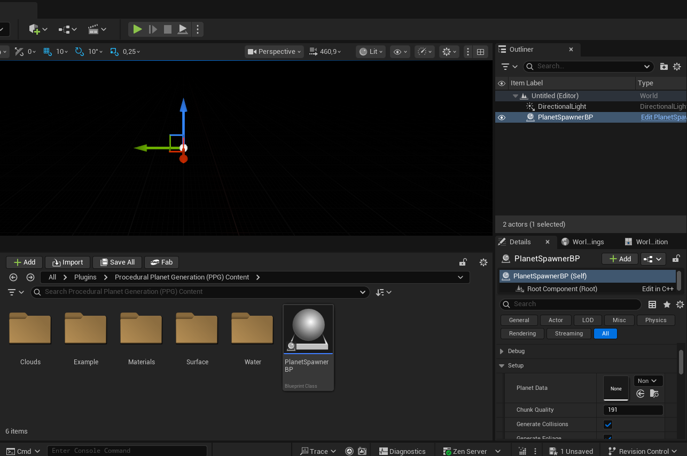
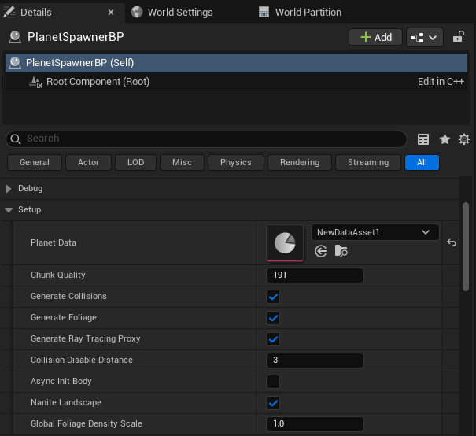
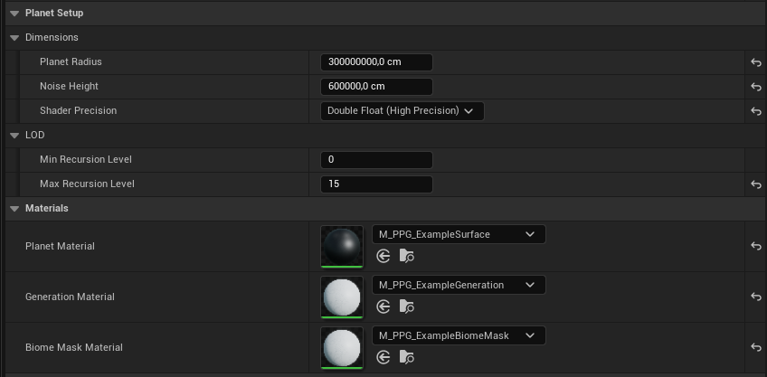
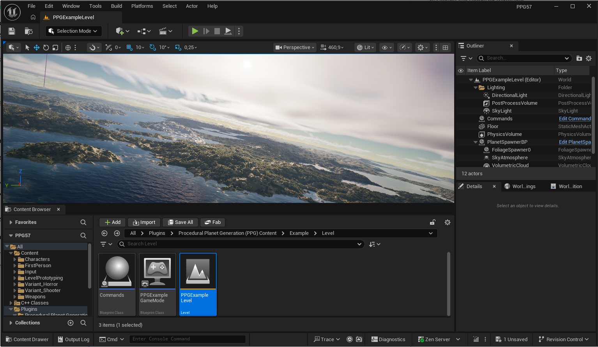

# Quick Start

This page starts from an empty or existing level and creates a planet using the plugin's reusable spawner Blueprint.

## 1. Drag the Planet Spawner Blueprint Into the Level

Enable plugin content in the Content Browser, then find the planet spawner Blueprint:

```text
Content/PlanetSpawnerBP
```

Drag it into the level. This Blueprint is the normal actor users should place in their scenes, not only an example asset. If your project or documentation labels it as `BPPlanetSpawner`, use that same spawner Blueprint.



## 2. Add a Planet Data Asset

Create a new `Planet Data Asset`, or duplicate the included starting asset:

```text
Content/Example/Assets/ExamplePlanetData
```

Assign this asset to the `Planet Data` field on the placed spawner Blueprint.

The planet data asset controls:

- planet radius and height scale
- minimum and maximum recursion levels
- surface, generation, and biome mask materials
- biome layer list
- biome cell layout and blending settings
- optional water settings



## 3. Assign the Required Materials

Open the Planet Data asset and assign the three core materials:

| Field | What It Does |
| --- | --- |
| `Planet Material` | Visible surface material used by generated terrain chunks. |
| `Generation Material` | Computes terrain height and vertex colors. |
| `Biome Mask Material` | Chooses biome IDs for the generated biome-cell map. |

For a first planet, use the included example materials as a reference and replace them once the basic pipeline works.



## 4. Add Biome Layers

In the Planet Data asset, add entries to `Biome Layers`.

Each layer can have:

- a display name
- optional foliage data
- material pins synchronized into the PPG material output nodes

Layer order matters. Later biome layers have higher biome-mask priority than earlier layers.

## 5. Rebuild the Planet Pipeline

In the Planet Data asset, run:

```text
Rebuild Planet Pipeline
```

This synchronizes material output pins, compiles planet materials, rebuilds the biome map, saves generated data, and regenerates placed planets that use this asset.

Use:

```text
Refresh Biome Map
```

when only biome-cell data needs to be rebuilt.

## 6. Tune the Spawner Settings

Select the placed spawner Blueprint in the level and review the first settings you are most likely to change:

| Setting | Meaning |
| --- | --- |
| `Planet Data` | The data asset that drives generation. |
| `Chunk Quality` | Vertex resolution per generated chunk. Higher values cost more memory and build time. |
| `Generate Collisions` | Creates collision for terrain chunks. |
| `Generate Foliage` | Enables foliage generation from biome foliage data. |
| `Nanite Landscape` | Builds Nanite terrain meshes where supported. Nanite chunks are slower to build than normal chunks, so enable it for rendering needs rather than faster generation. |
| `Use Editor Tick` | Allows editor-time generation/update behavior. |

## 7. Build or Regenerate the Planet

On the placed spawner Blueprint, call `Build Planet` or `Regenerate Planet` from Blueprint, C++, or editor tooling.

Generation runs chunk by chunk. `Last Generation Time Milliseconds` and `Show Generation Debug` help inspect generation progress and cost.

## Optional: Open the Example Level

The included example level is useful for comparison after you understand the basic setup:

```text
Content/Example/Level/PPGExampleLevel
```

Use it to inspect a complete planet configuration, example biome assets, water setup, and character/controller assets.


