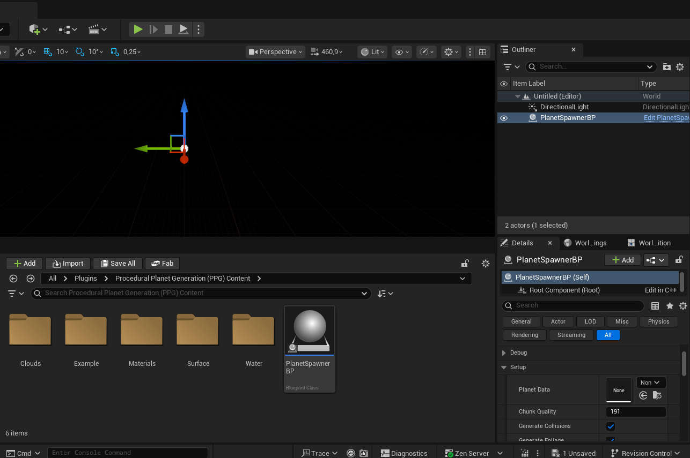
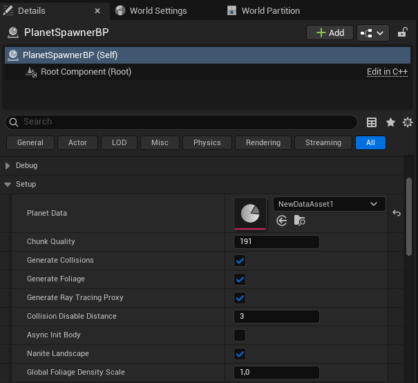
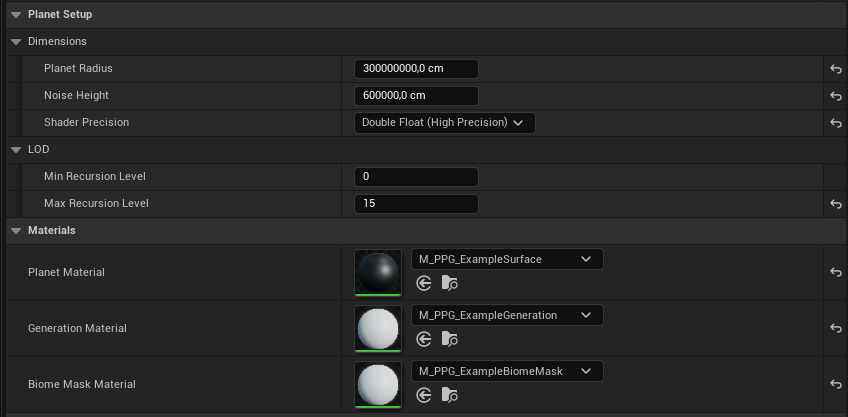
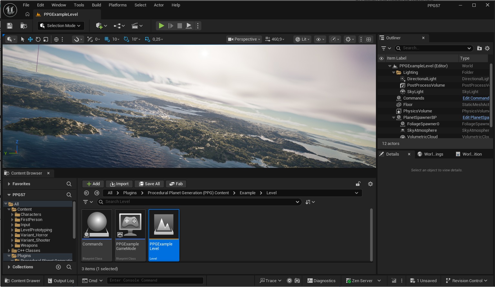

# Quick Start

This page starts from an empty or existing level and creates a planet using the plugin's reusable spawner Blueprint.

## 1. Drag the Planet Spawner Blueprint Into the Level

Enable plugin content in the Content Browser, then find the planet spawner Blueprint:

```text
Content/PlanetSpawnerBP
```

Drag it into the level. This Blueprint is the normal actor users should place in their scenes, not only an example asset. If your project or documentation labels it as `BPPlanetSpawner`, use that same spawner Blueprint.



## 2. Add a Planet Data Asset

Create a new `Planet Data Asset`, or duplicate the included starting asset:

```text
Content/Example/Assets/ExamplePlanetData
```

Assign this asset to the `Planet Data` field on the placed spawner Blueprint.

The planet data asset controls:

- planet radius and height scale
- deterministic generation seed
- minimum and maximum recursion levels
- surface, generation, and biome mask materials
- biome layer list
- optional water settings

Biome-cell layout is authored on `Planet Biome Mask Output`; biome transition and warp settings are authored on `Planet Elevation Output`.



## 3. Assign the Required Materials

Open the Planet Data asset and assign the three core materials:

| Field | What It Does |
| --- | --- |
| `Planet Material` | Visible surface material used by generated terrain chunks. |
| `Generation Material` | Computes terrain height and vertex colors. |
| `Biome Mask Material` | Chooses biome IDs for the generated biome-cell map. |

For a first planet, use the included example materials as a reference and replace them once the basic pipeline works.



## 4. Add Biome Layers

In the Planet Data asset, add entries to `Biome Layers`.

Each layer can have:

- a display name
- optional foliage data
- material pins matched by name across the PPG material output nodes

Layer order matters. Later biome layers have higher biome-mask priority than earlier layers.

## 5. Rebuild the Planet Pipeline

In the Planet Data asset, run:

```text
Rebuild Planet Pipeline
```

This synchronizes material output pins, compiles planet materials, rebuilds the biome map, saves generated data, and regenerates placed planets that use this asset.

Use:

```text
Refresh Biome Map
```

when only biome-cell data needs to be rebuilt.

## 6. Tune the Spawner Settings

Select the placed spawner Blueprint in the level and review the first settings you are most likely to change:

| Setting | Meaning |
| --- | --- |
| `Planet Data` | The data asset that drives generation. |
| `Chunk Quality` | Vertex resolution per generated chunk. Higher values cost more memory and build time. |
| `Generate Collisions` | Enables invoker-driven terrain collision generation. |
| `Wait For Initial Collision Before Generation Finished` | Keeps the initial loading event pending until requested collision is ready. |
| `Generate Foliage` | Enables foliage generation from biome foliage data. |
| `Nanite Landscape` | Builds Nanite terrain meshes where supported. Nanite chunks are slower to build than normal chunks, so enable it for rendering needs rather than faster generation. |
| `Max Concurrent GPU Generations` | Limits terrain and foliage GPU jobs waiting for readback. |
| `Use Editor Tick` | Allows editor-time generation/update behavior. |

Add a `PPG Planet Collision Invoker` component to a physical actor that needs nearby terrain collision. A `PPG Navigation Invoker Component` already fills this role when `Independent Navigation Generation` is disabled. For independent navigation over a larger area, use a separate collision invoker for the smaller area where physics is needed. Collision invokers use an explicit `Target Planet` or automatically select the nearest planet surface.

See [Collision Streaming](../features/collision.md) for collision radius, height activation, foliage collision, and editor placement settings.

To author localized terrain changes, place a `Planet Height Brush`, assign its `Target Planet`, and configure its height, biome, vertex-color, or texture-mask settings. See [Terrain Stamps](../features/terrain-stamps.md).

## 7. Build or Regenerate the Planet

The placed Blueprint normally calls `Build Planet` for you. Use `Regenerate Planet` after runtime changes that require a full rebuild.

Generation runs chunk by chunk. `Show Generation Debug`, `Last Generation Time Milliseconds`, and `Get Planet Generation Status` expose progress, phase, timing, and errors.

## Optional: Open the Example Level

The included example level is useful for comparison after you understand the basic setup:

```text
Content/Example/Level/PPGExampleLevel
```

Use it to inspect a complete planet configuration, example biome assets, water setup, and character/controller assets.



## Navigate Around the Planet

In a perspective level viewport, select a Planet Spawner and enable **Planet Camera** from the Level Editor toolbar. If no valid planet is selected, the camera targets the nearest planet in the viewport world.

Hold the right mouse button to navigate. Mouse look rotates relative to the planet surface, and `E`/`Q` moves radially away from or toward the planet. Use **Retarget Planet Camera** after selecting another planet.

Actors placed while Planet Camera is enabled are aligned to the surface of the targeted planet. Disable the mode to restore normal world-relative editor navigation.

See [Planet Camera](../features/planet-camera.md) for behavior and limitations.

## Alternative Quick Start Video Tutorial

<iframe
  width="100%"
  style="aspect-ratio: 16 / 9; border: 0;"
  src="https://www.youtube-nocookie.com/embed/AJdCiTK5O-A"
  title="Procedural Planet Generation Quick Start tutorial"
  allow="accelerometer; autoplay; clipboard-write; encrypted-media; gyroscope; picture-in-picture; web-share"
  allowfullscreen>
</iframe>
